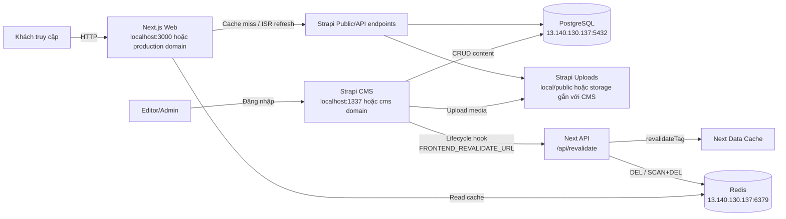
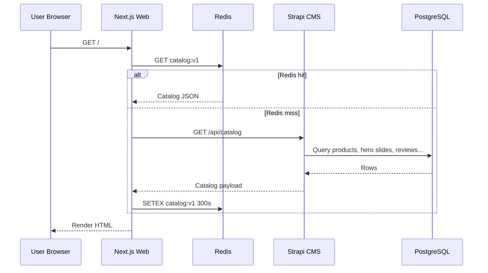
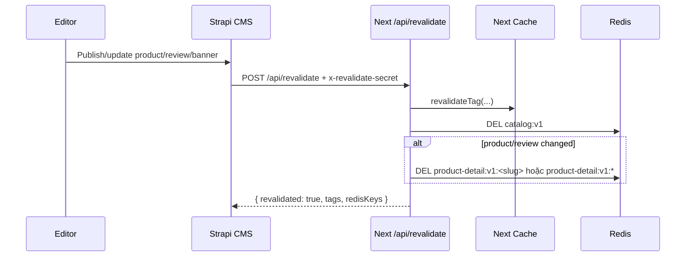

# System Architecture And Usage Runbook

Tài liệu này mô tả kiến trúc hiện tại của hệ thống shop online, giải pháp lấy
dữ liệu từ CMS, cache Redis, revalidate sau khi editor cập nhật nội dung, và
hướng dẫn sử dụng CMS cho nội dung/ảnh.

## 1. Tổng Quan

Hệ thống gồm hai ứng dụng chính:

- `apps/cms`: Strapi CMS để quản trị sản phẩm, banner, review, bài viết, FAQ,
  chính sách, site settings.
- `apps/web`: Next.js storefront hiển thị dữ liệu public từ CMS.

Hạ tầng dữ liệu dùng:

- PostgreSQL trên VPS `13.140.130.137:5432` cho CMS production/local-prod-db.
- Redis trên VPS `13.140.130.137:6379` cho cache dữ liệu storefront.
- Next.js cache tag/revalidate nội bộ để giảm số lần gọi CMS.

## 2. Sơ Đồ Kiến Trúc



## 3. Luồng Đọc Dữ Liệu Web



Product detail dùng key riêng:

```text
product-detail:v1:<product-slug>
```

Ví dụ:

```text
product-detail:v1:auto-reup-master
product-detail:v1:ai-voice-generator-pro
```

## 4. Luồng Cập Nhật CMS Và Revalidate



Mapping tag chính:

| CMS model | Next tags | Redis invalidation |
| --- | --- | --- |
| `product` | `catalog`, `products`, `product:<slug>` | `catalog:v1`, `product-detail:v1:<slug>` |
| `review` | `catalog`, `reviews`, `products` | `catalog:v1`, `product-detail:v1:*` |
| `hero-slide` | `catalog`, `hero-slides` | `catalog:v1` |
| `category` | `catalog`, `categories`, `products` | `catalog:v1` |
| `blog-post` | `catalog`, `blog-posts`, `blog:<slug>` | `catalog:v1` |
| `faq` | `catalog`, `faqs` | `catalog:v1` |
| `testimonial` | `catalog`, `testimonials` | `catalog:v1` |
| `site-setting` | `catalog`, `site-settings` | `catalog:v1` |

## 5. Cache Strategy

Hiện hệ thống có 3 lớp giảm tải:

1. Next fetch cache:
   - `fetchStrapiJson` dùng `next: { tags: [tag], revalidate: 60 }`.
   - Tự refresh sau 60 giây hoặc khi `/api/revalidate` gọi `revalidateTag`.

2. Next `unstable_cache`:
   - `getCatalog` cache key `catalog`.
   - `getProductDetail(slug)` cache key `product-detail + slug`.
   - Revalidate 60 giây.

3. Redis:
   - `catalog:v1`: TTL 300 giây.
   - `product-detail:v1:<slug>`: TTL 300 giây.
   - fallback product detail: TTL 60 giây để tránh giữ dữ liệu mặc định quá lâu.
   - Redis operation timeout: 1500 ms. Nếu Redis lỗi hoặc chậm, web bỏ qua Redis
     và fallback sang CMS/Next cache thay vì làm sập request.

Lý do giữ cả Next cache và Redis:

- Next cache nhanh trong cùng runtime.
- Redis chia sẻ cache giữa nhiều process/container/web instance.
- Khi CMS chậm hoặc DB chậm, Redis giảm tải đáng kể cho homepage và product
  detail, là hai bề mặt đọc nhiều nhất.

## 6. Cấu Hình Env

Frontend bắt buộc:

```env
NEXT_PUBLIC_SITE_URL=https://hieuchanlaptrinh.top
NEXT_PUBLIC_STRAPI_URL=https://cms.hieuchanlaptrinh.top
STRAPI_INTERNAL_URL=http://cms:1337
STRAPI_API_TOKEN=<token-public-read>
REVALIDATE_SECRET=<same-secret-with-cms>
RATE_LIMIT_SALT=<random-secret>
REDIS_URL=redis://13.140.130.137:6379
REDIS_CACHE_DISABLED=false
```

CMS bắt buộc:

```env
DATABASE_CLIENT=postgres
DATABASE_HOST=13.140.130.137
DATABASE_PORT=5432
DATABASE_NAME=onlineshopdb
DATABASE_USERNAME=onlineshop
DATABASE_PASSWORD=<db-password>
DATABASE_SSL=false
FRONTEND_URL=https://hieuchanlaptrinh.top
FRONTEND_REVALIDATE_URL=https://hieuchanlaptrinh.top/api/revalidate
REVALIDATE_SECRET=<same-secret-with-frontend>
```

Local-prod-db script hiện đặt:

```text
CMS:   http://localhost:1337
Web:   http://localhost:3000
Redis: redis://13.140.130.137:6379
```

Chạy local:

```powershell
.\scripts\start-local-prod-db.ps1 -Restart -SkipCmsBuild
```

Hoặc chạy từng script đã generate:

```powershell
.\.local\run\cms-local-prod-db.ps1
.\.local\run\web-local-prod-db.ps1
```

Nếu CMS báo port `1337` đang dùng:

```powershell
Get-NetTCPConnection -LocalPort 1337 | Select-Object OwningProcess
Get-Process -Id <PID>
Stop-Process -Id <PID>
```

## 7. Hướng Dẫn Sử Dụng CMS

### 7.1 Product

Content type: `Product`

Field bắt buộc/khuyến nghị:

| Field | Cách nhập |
| --- | --- |
| `name` | Tên sản phẩm, ví dụ `Auto Reup Master` |
| `slug` | Để CMS auto từ name, sau khi public không đổi nếu không cần |
| `shortDescription` | 1-2 câu ngắn, dùng trên card và SEO |
| `description` | Mô tả đầy đủ, dùng ở trang chi tiết |
| `price` | VND, nhập số nguyên, ví dụ `990000` |
| `compareAtPrice` | Giá gạch nếu có, phải lớn hơn `price` |
| `badge` | `hot`, `bestseller`, `new`, hoặc `featured` |
| `rating` | Không dùng để hiển thị chính; web tự tính từ review approved |
| `reviewCount` | Không dùng để hiển thị chính; web tự đếm review approved |
| `category` | Chọn category đúng |
| `media` | Ảnh/video gallery, ảnh đầu tiên là ảnh card và ảnh chính |
| `features` | Mỗi ý một dòng |
| `usageSteps` | Mỗi bước một dòng |
| `purchaseUrl` | Link mua hoặc `/lien-he?product=<slug>` |
| `zaloUrl` | Link tư vấn Zalo nếu có |

Quy tắc:

- Không đổi `slug` sau khi đã có traffic, vì URL web là `/san-pham/<slug>`.
- Ảnh đầu tiên trong `media` phải là ảnh đẹp nhất, vì được dùng cho product
  card, gallery mặc định và Open Graph fallback.
- Số sao và số lượng đánh giá trên web được tính từ các `Review` có
  `approved = true` và relation đúng product. Không cần sửa tay `rating` hoặc
  `reviewCount` trên Product.
- Sau khi sửa Product, bấm `Save` và `Publish`. Web sẽ tự revalidate nếu
  `FRONTEND_REVALIDATE_URL` và `REVALIDATE_SECRET` đúng.

### 7.2 Hero Slide / Banner Auto Slide

Content type: `Hero Slide`

Field:

| Field | Cách nhập |
| --- | --- |
| `title` | Tên offer/sản phẩm, nên dưới 55 ký tự |
| `slug` | Auto từ title |
| `description` | 1-2 câu, nên dưới 160 ký tự |
| `sortOrder` | Số nhỏ hiển thị trước, ví dụ `10`, `20`, `30` |
| `active` | Bật để hiển thị |
| `image` | Ảnh banner theo tỷ lệ 4:3 |
| `product` | Bắt buộc chọn product để nút `Xem chi tiết` chạy đúng |

Nếu banner mất trên web, kiểm tra theo thứ tự:

1. Hero Slide đã `Published`.
2. `active = true`.
3. Có chọn `image`.
4. Có chọn `product`, và product đó cũng đã `Published`.
5. Revalidate đã chạy hoặc đợi TTL 60-300 giây.

### 7.3 Review

Content type: `Review`

Field:

| Field | Cách nhập |
| --- | --- |
| `name` | Tên người review |
| `slug` | Có thể dùng `ten-san-pham-ngay-thang` |
| `rating` | Số nguyên 1-5 |
| `comment` | Nội dung review, tối thiểu 10 ký tự trên frontend form |
| `approved` | Chỉ review approved mới hiển thị |
| `product` | Phải chọn đúng sản phẩm |

Quan trọng:

- Nếu sửa review nhưng web chưa đổi, kiểm tra `product` relation trước. Trang
  chi tiết sản phẩm chỉ lấy review thuộc đúng product.
- Nếu đổi review từ product A sang product B, revalidate sẽ xóa
  `product-detail:v1:*`, nên cả hai trang product sẽ tự cập nhật sau request
  tiếp theo.
- Review do người dùng gửi qua frontend cần được kiểm duyệt trong CMS trước khi
  đặt `approved = true`.

### 7.4 Blog Post

Content type: `Blog Post`

Khuyến nghị:

- `title`: dưới 70 ký tự.
- `excerpt`: 120-180 ký tự.
- `seoTitle`: dưới 60 ký tự.
- `seoDescription`: 140-160 ký tự.
- `image`: dùng tỷ lệ 16:10.

## 8. Quy Chuẩn Ảnh

Frontend đang render phần lớn ảnh theo tỷ lệ cố định. Upload sai tỷ lệ vẫn hiển
thị được do `object-fit: cover`, nhưng ảnh có thể bị crop. Luôn đặt chủ thể ở
vùng trung tâm.

| Vị trí | Tỷ lệ render | Kích thước khuyến nghị | Tối thiểu | Dung lượng mục tiêu |
| --- | --- | --- | --- | --- |
| Hero/Banner auto slide | 4:3 | `1600 x 1200` | `1200 x 900` | `< 350 KB` |
| Product card | 4:3 | `1200 x 900` | `900 x 675` | `< 250 KB` |
| Product gallery ảnh chính | 4:3 | `1600 x 1200` | `1200 x 900` | `< 350 KB` |
| Product gallery thumbnail | 4:3 | CMS tự resize từ ảnh chính | Không upload riêng | N/A |
| Blog card/detail image | 16:10 | `1200 x 750` | `960 x 600` | `< 250 KB` |
| Product icon | 1:1 | `512 x 512` | `256 x 256` | `< 100 KB` |
| Open Graph/social share | 1.91:1 | `1200 x 630` | `1200 x 630` | `< 300 KB` |

Định dạng:

- Ưu tiên `WebP`.
- Dùng `JPG` cho ảnh chụp/phối cảnh nếu WebP chưa tiện.
- Dùng `PNG` chỉ khi cần nền trong suốt.
- Tránh upload SVG từ nguồn không tin cậy.
- Video demo nên dùng MP4/H.264, dung lượng nhỏ hơn 10 MB nếu upload vào CMS.

Safe area:

- Hero/banner: giữ logo, text trong vùng giữa 70% ảnh; tránh sát mép vì mobile
  có thể crop.
- Product: chủ thể nằm giữa, không đặt chữ nhỏ trong ảnh.
- Blog: tránh text nằm ở mép trái/phải; ảnh có thể bị crop nhẹ ở card.

Alt text:

- Viết mô tả cụ thể, ví dụ `Giao diện Auto Reup Master hiển thị lịch đăng`.
- Không dùng `image`, `banner`, `photo`.
- Không nhồi keyword.

## 9. Hướng Dẫn Kiểm Tra Sau Khi Cập Nhật CMS

### 9.1 Kiểm tra CMS trả dữ liệu

Mở CMS local:

```text
http://localhost:1337/admin
```

Kiểm tra content đã `Published`, đúng relation, đúng media.

### 9.2 Kiểm tra web local

```text
http://localhost:3000
http://localhost:3000/san-pham/<slug>
```

Nếu vừa sửa CMS mà web chưa đổi:

1. Chờ 60 giây để Next cache tự refresh.
2. Kiểm tra CMS lifecycle có gọi `/api/revalidate`.
3. Kiểm tra Redis key còn giữ dữ liệu cũ không.

### 9.3 Kiểm tra Redis

Từ thư mục `apps/web`:

```powershell
node -e "const {createClient}=require('redis');(async()=>{const c=createClient({url:'redis://13.140.130.137:6379'});await c.connect();console.log(await c.keys('catalog:*'));console.log(await c.keys('product-detail:v1:*'));await c.quit();})()"
```

Xem TTL:

```powershell
node -e "const {createClient}=require('redis');(async()=>{const c=createClient({url:'redis://13.140.130.137:6379'});await c.connect();for(const k of ['catalog:v1','product-detail:v1:product']) console.log(k, await c.ttl(k));await c.quit();})()"
```

Xóa cache thủ công khi cần:

```powershell
node -e "const {createClient}=require('redis');(async()=>{const c=createClient({url:'redis://13.140.130.137:6379'});await c.connect();await c.del('catalog:v1');for await (const keys of c.scanIterator({MATCH:'product-detail:v1:*',COUNT:100})) if(keys.length) await c.del(keys);await c.quit();})()"
```

## 10. Checklist Deploy/Vận Hành VPS

Trước deploy:

- `deploy/env/frontend.env` có `REDIS_URL=redis://13.140.130.137:6379`.
- `REDIS_CACHE_DISABLED=false`.
- Frontend và CMS dùng cùng `REVALIDATE_SECRET`.
- CMS có `FRONTEND_REVALIDATE_URL=https://hieuchanlaptrinh.top/api/revalidate`.
- `STRAPI_API_TOKEN` còn hợp lệ và có quyền read public content cần thiết.
- Redis port `6379` chỉ mở cho server cần dùng; không mở public nếu không có
  firewall/password phù hợp.

Kiểm tra port Redis từ máy chạy web:

```powershell
Test-NetConnection 13.140.130.137 -Port 6379
```

Kiểm tra web health:

```bash
bash scripts/healthcheck.sh
```

Kiểm tra env trước deploy:

```bash
bash scripts/verify-env.sh
```

## 11. Troubleshooting

### Web vẫn hiện dữ liệu mặc định

Nguyên nhân thường gặp:

- `STRAPI_INTERNAL_URL` hoặc `NEXT_PUBLIC_STRAPI_URL` sai.
- `STRAPI_API_TOKEN` thiếu hoặc hết quyền.
- Public/API permission trong CMS chưa bật read cho content published.
- CMS endpoint `/api/catalog` lỗi nên web fallback sang `fallbackData`.

Cách kiểm tra:

- Xem log web có lỗi `strapi_fetch_failed`.
- Mở trực tiếp CMS admin kiểm tra content đã published.
- Kiểm tra token trong env frontend.

### Banner auto slide mất

Nguyên nhân thường gặp:

- Không có Hero Slide published.
- `active=false`.
- Hero Slide thiếu image.
- Hero Slide không chọn product, hoặc product chưa published.
- Revalidate chưa chạy và cache cũ vẫn còn.

Cách xử lý nhanh:

- Publish lại Hero Slide.
- Chọn product relation.
- Xóa Redis `catalog:v1`.
- Refresh homepage.

### Review đã sửa trong CMS nhưng web chưa đổi

Nguyên nhân thường gặp:

- Review chưa chọn đúng product.
- `approved=false`.
- Product detail đang còn cache.
- CMS lifecycle không gọi được frontend revalidate.

Cách xử lý nhanh:

- Mở review trong CMS, chọn lại product đúng, bật `approved`.
- Save.
- Xóa `product-detail:v1:<slug>` hoặc toàn bộ `product-detail:v1:*`.
- Refresh `/san-pham/<slug>`.

### Web/CMS tải chậm

Kiểm tra theo thứ tự:

1. Redis reachable không.
2. Redis có key warm không.
3. CMS query `/api/catalog` mất bao lâu.
4. PostgreSQL có chậm network/VPS không.
5. Media ảnh có quá nặng không.

Quick checks:

```powershell
Test-NetConnection 13.140.130.137 -Port 6379
Test-NetConnection 13.140.130.137 -Port 5432
```

Nếu ảnh nặng:

- Convert ảnh sang WebP.
- Giữ hero dưới 350 KB.
- Giữ product/blog card dưới 250 KB.
- Không upload ảnh 4K trực tiếp nếu web chỉ cần 1200-1600 px.

## 12. Quy Tắc Cho Agent Khi Sửa Tiếp

Khi sửa kiến trúc data/cache:

- Không bỏ fallback Redis timeout; request web không được phụ thuộc cứng vào
  Redis.
- Nếu thêm content type mới vào `/api/catalog`, phải thêm tag revalidate tương
  ứng và cân nhắc Redis invalidation.
- Nếu đổi tỷ lệ ảnh trong UI, cập nhật bảng `Quy Chuẩn Ảnh` trong tài liệu này.
- Nếu thêm trang detail mới có dữ liệu CMS riêng, dùng key Redis có version
  prefix, ví dụ `blog-detail:v1:<slug>`.
- Không dùng `KEYS product-detail:*` trong production path; dùng `SCAN` như
  helper hiện tại.
